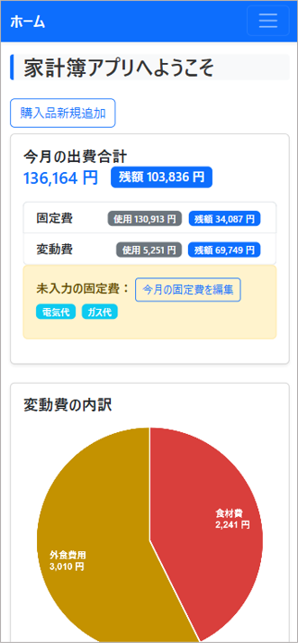
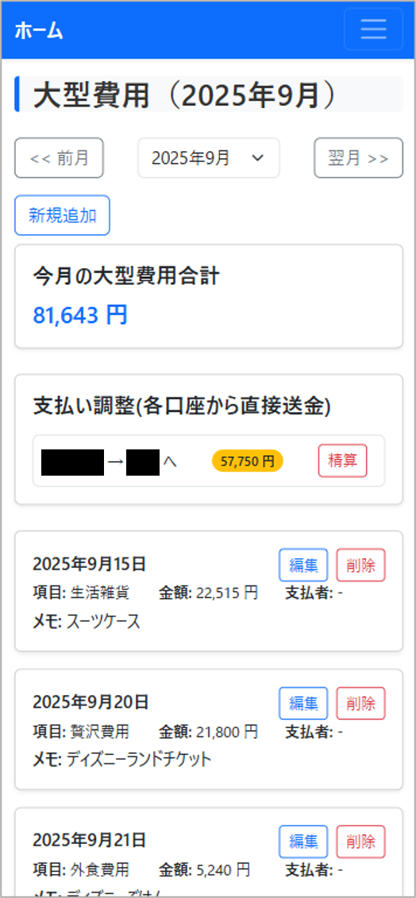

# 家計簿アプリ（Django）

このアプリケーションは、**夫婦・家族で家計を共同管理するための Django 製家計簿アプリ**です。  
変動費・固定費・大型出費の管理、月次サマリー、年次推移の可視化など、日々の記録から長期的な分析まで一貫して行えます。

また、入力の効率化として **レシート画像から金額を抽出する補助機能（OpenAI Vision）** や、  
**金額フィールドで使える内蔵電卓機能** などの便利機能も備えています。

---

## 📱 画面例（iPhone表示）

<p align="center">
  
  
</p>

※ 上記は **iPhone 12 サイズで表示した際の画面例**です。

---

## 📦 主な機能

### 📊 支出管理
- **変動費管理** - 日用品、食費、娯楽費などの日々の支出を記録
- **固定費管理** - 家賃、光熱費(水道のみ隔月)、サブスクなどの月間固定支出を管理
- **大型出費管理** - 家電、旅行、医療費などの高額な一時的支出を記録
- **費目別・立替者別集計** - 支出の詳細な分析と集計表示
- **個人用家計簿** - 各メンバー個人の変動費・固定費（給与・控除・折半費等）を月次管理

### 🧮 便利機能
- **予算設定**：固定費・変動費を設定し、ホーム画面で超過確認
- **電卓機能**：すべての金額入力フィールドに対応
- **月別表示**：月ごとの支出推移表示
- **立替者管理**：家庭内での立替精算の管理
- **固定費支払い方法管理**：固定費とどのクレジットカードで払っているかの情報を管理
- **集計データ**：固定費+変動費、大型費用の次ごとの変遷の確認
- **レシート自動読取**：スマフォカメラとAIを用いて自動で費用を取得
- **外食費一括入力(個人用家計簿)**：個人用家計簿で1か月分の外食費を日別に一括登録（既存データは合算表示・上書き対応）

### 🔐 認証・セキュリティ
- ユーザー登録・認証（メール有効化付き）
- ユーザー情報の編集・パスワード変更
- セキュアなカスタムユーザーモデル（`accounts.User`）
- BCrypt による安全なパスワードハッシュ
- `@login_required` によるアクセス制限
- CSRF 対策など Django 標準の安全機構

### 🎨 UI・UX
- Bootstrap 5 + カスタムCSSによる直感的なUI
- レスポンシブデザイン対応
- 日本語完全対応

---

## 🗂️ ディレクトリ構成
```
CHAproject/
├── CHAproject/               # Django プロジェクト設定
│   ├── settings.py           # DB・認証・静的ファイル設定
│   ├── urls.py               # URL ルーティング
│   └── ...
│
├── accounts/                 # ユーザー認証・管理アプリ
│   ├── models.py             # カスタムユーザーモデル
│   ├── forms.py              # 登録・ログイン・編集フォーム
│   ├── views.py              # 認証/登録/メール確認などの処理
│   └── ...
│
├── core/                     # ホーム・共通ビュー
│   ├── receipt_reader.py     # gpt-4.1-miniを用いたレシート情報自動読み取り
│   └── views.py              # ホーム画面・統計ウィジェット
│
├── variablecosts/            # 変動費管理アプリ
│   ├── models.py             # 費目・支出モデル
│   ├── views.py              # 登録・編集・削除・月別表示
│   └── ...
│
├── fixedcosts/               # 固定費管理アプリ
│   ├── models.py             # 固定費モデル
│   ├── views.py
│   └── ...
│
├── largecosts/               # 大型出費管理アプリ
│   ├── models.py
│   ├── views.py
│   └── ...
│
├── privatecosts/             # 個人用家計簿アプリ
│   ├── models.py             # PrivateVariableCost・PrivateFixedCost モデル
│   ├── views.py              # 個人変動費・個人固定費・レシート読み取り
│   └── ...
│
├── templates/                # HTML テンプレート
│   ├── base.html             # 共通レイアウト
│   ├── accounts/             # 認証関連テンプレート
│   ├── variablecosts/        # 変動費画面
│   ├── fixedcosts/
│   ├── largecosts/
│   ├── privatecosts/         # 個人用家計簿画面
│   └── ...
│
├── static/                   # CSS / JS など静的ファイル
│   └── css/custom.css
│
├── requirements.txt          # 依存パッケージ
├── manage.py
└── .gitignore
```
---

## 🖥️ 使用技術

- **バックエンド**: Python 3.11+ / Django 5.2
- **データベース**: PostgreSQL（Supabase対応）
- **フロントエンド**: HTML5 / Bootstrap 5 / JavaScript（電卓機能）
- **スタイリング**: CSS3 + django-widget-tweaks
- **静的ファイル**: Whitenoise
- **WSGIサーバ**: Gunicorn
- **コード品質**: Ruff（リンティング・フォーマット）
- **環境管理**: python-dotenv

## 🔧 セットアップ方法

### 1. リポジトリをクローン

```bash
git clone https://github.com/your-username/CHAproject.git
cd CHAproject
```

### 2. 仮想環境を作成

```bash
python -m venv venv
source venv/bin/activate  # Windowsは venv\Scripts\activate
```

### 3. 依存パッケージのインストール

```bash
pip install -r requirements.txt
```

### 4. .env ファイルを作成

プロジェクトルートに `.env` を作成し、以下を記載：

```ini
SECRET_KEY=your-secret-key
dbname=your-db-name
user=your-db-user
password=your-db-password
host=your-db-host
port=5432
EMAIL_HOST_USER=your-email@example.com
EMAIL_HOST_PASSWORD=your-email-password
RENDER_EXTERNAL_HOSTNAME=your-render-hostname.onrender.com
OPENAI_API_KEY=your-openai-api-key   # レシート読み取り利用時のみ
```

### 5. マイグレーションと管理ユーザー作成

```bash
python manage.py migrate
python manage.py createsuperuser
```

### 6. ローカルサーバーで起動

```bash
cd CHAproject  # プロジェクトディレクトリに移動
python manage.py runserver
```

ブラウザで http://localhost:8000 にアクセス。

---

## 🔨 開発・メンテナンス

### コード品質管理

```bash
# コードフォーマット
ruff format .

# リンティング
ruff check .

# リンティングエラーの自動修正
ruff check --fix .
```

### データベース操作

```bash
# モデル変更後のマイグレーション作成
python manage.py makemigrations

# マイグレーション実行
python manage.py migrate

# テストデータの作成（管理画面から費目・立替者を追加）
python manage.py createsuperuser
```

## 🚀 デプロイ

Render.com での運用設定：

- **ビルドコマンド**: 
  ```bash
  pip install -r requirements.txt
  python manage.py collectstatic --noinput
  python manage.py migrate
  ```
- **起動コマンド**: `gunicorn CHAproject.wsgi`
- **環境変数**: `.env` に従って設定
- **静的ファイル**: WhiteNoise で自動配信


## 📧 メール設定（Gmailの場合）

`.env` に以下を設定：

```bash
EMAIL_HOST_USER=your-gmail@gmail.com
EMAIL_HOST_PASSWORD=your-app-password  # 2段階認証後に生成したアプリ用パスワード
```


## 🛡️ セキュリティ

- **カスタムユーザーモデル**: 拡張性の高い設計で将来的な機能追加に対応
- **強力なパスワードハッシュ**: BCrypt による安全なパスワード暗号化
- **CSRF保護**: 全フォームでCSRF攻撃を防御
- **認証制限**: `@login_required` デコレーターによる適切なアクセス制御
- **環境変数管理**: 機密情報の安全な管理

---

## 💡 使用方法・Tips

### 👍 初回セットアップ後の推奨手順
1. **管理画面** (`/admin/`) にアクセスしてスーパーユーザーでログイン
2. **費目（CostItem）** を追加（食材費、生活雑貨、贅沢費用など）
3. **立替者（Payer）** を追加（自分、パートナーなど）※個人用家計簿の使用者も兼ねます
4. **予算（Budget）** を設定（固定費・変動費それぞれ）
#### 📌費目（CostItem）についての重要な注意

`core/models.py` に定義されている **費目（CostItem）** は、レシート読み取りAIのモデルが学習時に使用した分類と一致させる必要があります。

そのため、費目名は以下の6項目のみを使用してください。

- 食材費
- 外食費用
- 生活雑貨
- 贅沢費用
- その他
- 医療費

上記以外の費目名を追加すると、AI が正しくカテゴリ判定できなくなる可能性があります。


## 📌 注意事項

- **ユーザー登録**: デフォルトでは誰でも登録可能（運用に合わせて制限を検討）
- **メール機能**: SMTP設定が必要（Gmail推奨）
- **管理画面**: `/admin/` からアクセス可能
- **データバックアップ**: 定期的なデータベースバックアップを推奨


## 📝 ライセンス

MIT License


## 🙌 作者

- 名前：Rkawab
- GitHub: @Beecom